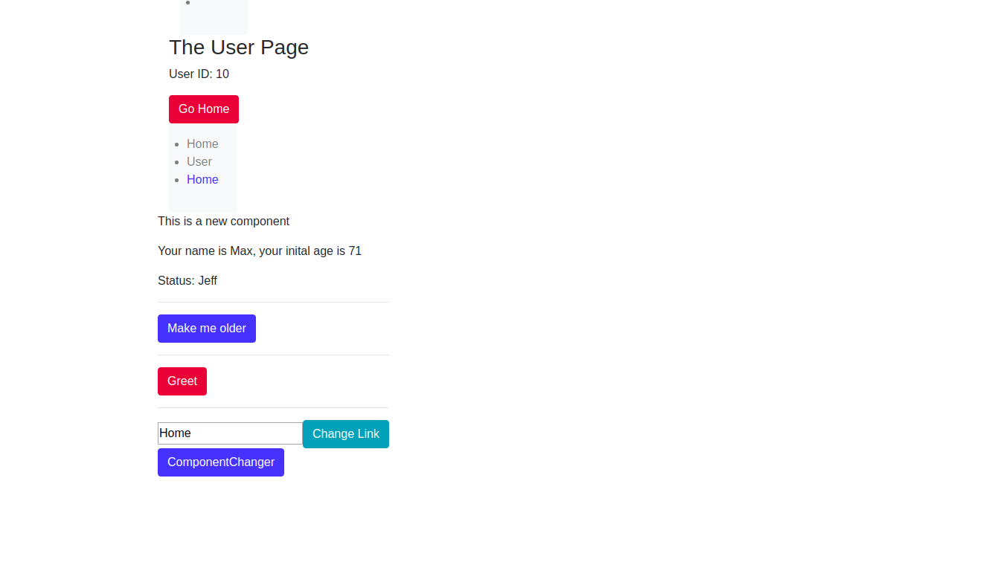

## React Practice :rocket: WIP!

This is a small application with react.js. where I am working with the ***State*** and ***routing***. 

<p align="center"> 

</p>


## Project Info

This projct uses [bootstrap](https://getbootstrap.com) as framework, [fontawsome](https://fontawesome.com/) for icons and ***webpack*** as the ***task-manager***.

## Local Version

If you have cloned the repository please run:

```
yarn && yarn start
```
Have fun! :star: :star: :star:
 
